# CastMe 架构、职责与端到端流程地图

> 文档类型：当前架构（As-Is）与优化导航（To-Be Compass）
> 基线：`main` 分支，提交 `f4caa4b`，2026-07-20
> 阅读顺序：系统与模块 → 总流程 → 端到端场景 → 路由参考 → Golden 覆盖 → 优化方向

## 0. 系统本质

CastMe 不是传统应用，没有仓库内的常驻服务、数据库或图像生成代码。它是一个声明式 Agent Skill：宿主读取 Markdown 合约，在当前对话中维护决策状态，再通过宿主提供的图像生成或编辑能力调用 GPT Image 2。

因此：

- Module 是一组有明确职责与 Interface 的行为合约。
- 稳定的 Markdown 标题是 Interface 所在的 Seam。
- ChatGPT、Codex 或其他 API 宿主提供真正执行图像能力的 Adapter。
- 只有 `skills/cast-me/` 会作为运行时包安装；仓库其他文件用于说明、治理和验证。

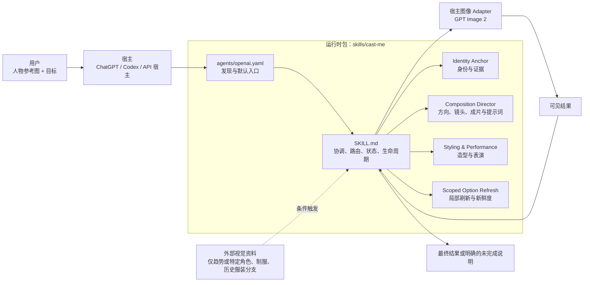

### 仓库层次与信息源职责

| 层次 | 文件 | 职责 | 是否运行时自动读取 |
| --- | --- | --- | --- |
| 安装入口 | `skills/cast-me/agents/openai.yaml` | 展示名、默认提示、隐式调用元数据 | 是 |
| 协调 Module | `skills/cast-me/SKILL.md` | 路由、Choice Gate、决策状态、四阶段生命周期、完成条件 | 是 |
| 所有者 Module | `skills/cast-me/references/*.md` | 身份、构图、造型表演、局部刷新领域知识 | 按需 |
| 用户说明 | `README.md` | 安装、调用和用户示例 | 否 |
| 规范术语 | `CONTEXT.md` | 唯一领域词汇表 | 否 |
| 架构决定 | `docs/adr/*.md` | 已接受的模块边界和取舍 | 否 |
| 规格与研究 | `.scratch/*` | PRD、研究、实施计划 | 否 |
| 行为验证 | `evals/golden-conversations.md` | 可观察行为回归合约 | 否 |
| 贡献约束 | `AGENTS.md`、`docs/agents/*.md` | 修改、Issue、术语与 Triage 规则 | 否 |

运行时、规范术语、ADR、Golden 或 README 相互矛盾时，应把它视为文档或实现漂移并显式修复，不能用简单的文件优先级掩盖冲突。

安装路径只有入口不同：ChatGPT 本地上传 `skills/cast-me` 后通过自动匹配或 `@CastMe` 调用；Codex 安装同一目录后在新会话中用 `$cast-me`。两者进入同一套运行时合约。

## 1. Module、Interface 与职责

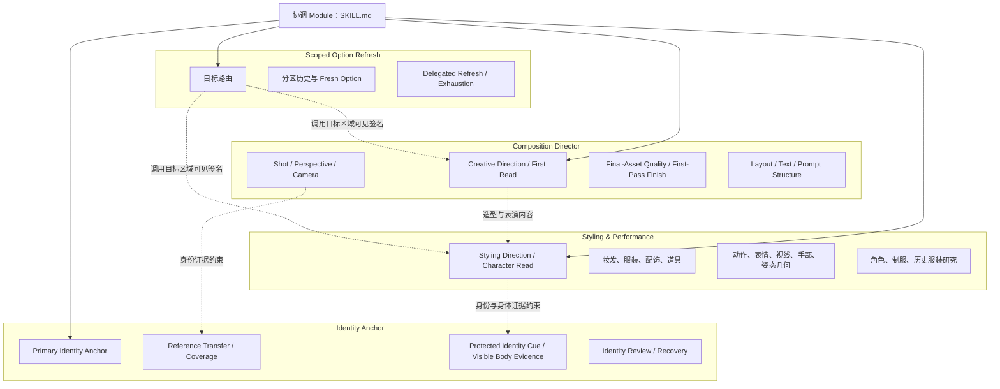

### Module Interface 一览

| Module | Interface 输入 | 拥有 | 明确不拥有 | 输出 |
| --- | --- | --- | --- | --- |
| `SKILL.md` | 用户请求、参考图、对话状态、宿主能力 | 路由、Gate 格式、状态、生命周期、安全异常、完成条件 | 各视觉领域的具体生产知识 | 下一道问题、生产提示词、调用或停止说明 |
| `identity-anchor.md` | 人物图、目标角度/身体/动作、可见结果 | 身份锚、证据、Coverage、Inference Boundary、Identity Review、恢复分类 | 具体镜头、造型、表演选项 | 身份约束、证据状态、风险 Gate、恢复路径 |
| `composition-director.md` | 用途、方向、画布、镜头、成片要求 | First Read、方向、镜头、透视、成片质量、Finish、布局、文字、提示词结构 | 妆发服装与表演内容 | 构图与成片贡献、输出合约、提示词骨架 |
| `styling-performance.md` | 角色/故事、妆发服装、道具、动作 | Styling Direction、Character Read、Story Makeup、Look Continuity、表演、姿态、视觉研究 | 裁切、相机位置、背景空间、身份证据本身 | 造型表演贡献、研究锚点、姿态链 |
| `scoped-option-refresh.md` | 更多、换一批、换某项、你决定 | 刷新目标、最近 Gate、分区历史、新鲜度、委派、耗尽 | 目标区域的具体候选内容 | 新批次、内部选项或重开一个限制锁的 Gate |
| 宿主图像 Adapter | 提示词、实际图像、可用控制 | 执行生成或编辑 | CastMe 领域决策与完成判断 | 图像及可验证的能力、尺寸信息 |

### 刻意不拆出的职责

| 关注点 | 当前归属 | 约束 |
| --- | --- | --- |
| 妆容 | `Styling Direction` | 不增加 Makeup Gate 或独立化妆 Module |
| 润饰和成片 | `First-Pass Finish` | 第一次生成时完成，不建立强制后处理流程 |
| 安全 | `SKILL.md` 异常分支 | 不是普通创意维度 |
| Physical Scene Coherence | Composition 内部检查 | 不是新的用户 Gate |
| Identity Review | Identity Anchor | 身份通过与恢复分类由同一所有者判断 |
| Look Continuity | Styling，仅系列任务 | 单张图不创建连续性状态 |
| 质量与尺寸 | Composition + 宿主事实 | 不添加质量问卷，不声称不可验证的控制 |

这些边界对应现有 ADR：身份优先于未确认的故事变换；妆容留在 Styling；风险由 Protected Identity Cue 是否被替换或遮挡触发；Character Read 是创意意图；Story Makeup 必须穿过 Finish；优先加深现有 Styling 和 Identity Module。

## 2. 共享决策状态与用户 Interface

所有 Module 共用当前对话中的决策状态。它不是数据库，也不承诺跨会话历史。

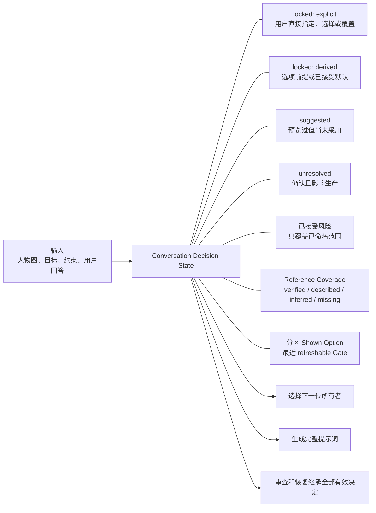

### 状态变化规则

| 当前状态 | 事件 | 新状态 |
| --- | --- | --- |
| `unresolved` | 用户直接指定或选择当前维度 | `locked: explicit` |
| `suggested` | 已选选项把它作为明确前提，或用户接受推荐默认 | `locked: derived` |
| `suggested` / `derived` | 用户重复、细化或覆盖 | `locked: explicit` |
| `derived` | Scoped Refresh 命中其所属区域 | `unresolved` |
| `explicit` | 用户明确重开该字段 | `unresolved` |

`locked: explicit` 始终优先于冲突的非显式值。接受某个风险只覆盖已命名的 cue、遮挡、角度、变换或缺失证据，不是全局免责。

### Choice Gate 合约

每个用户可见 Gate 都使用同一个 Interface：

1. 本地化推荐句和一个简短理由。
2. A/B/C 三个当前范围内有效的具体方案；只有两个实质方案时，C 表示保持现状并停止。
3. 永久存在的 `D) Custom`，只允许在当前 Gate 范围内自定义。
4. 回复示例同时展示裸推荐项，以及推荐项加本地化 `use recommended defaults`。

D 占位符本身不创建锁或历史；具体 Custom 答案才由当前 Gate 校验。裸字母只解决当前选项拥有的字段。全局 `you decide` 结束普通澄清，但不会绕过 Reference Coverage、身份风险、安全或精确文字 Gate。

八个生产维度只是内部检查顺序，不是八轮问卷：输出类型/画布 → 创意方向 → 镜头/透视 → 造型/妆发/道具 → 画幅/文字 → 表演 → Finish → 避免项。已锁定、无关或已接受默认的维度直接跳过。

## 3. 唯一总流程

后面的九个场景流程都复用这条主干。任何场景都必须能从 P1 走到 P11，或在一个明确阻塞处诚实停止。

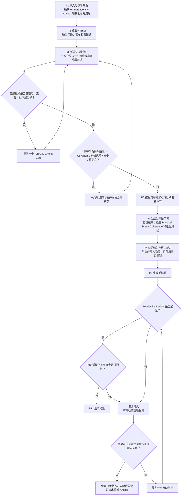

### 完成条件

- 所有必需聚焦 Gate 已解决。
- 每张必需人物参考都作为实际图像输入传入。
- 用户锁定意图没有被静默改变。
- 可见且可检查的结果通过 Identity Review。
- 本次参与生成或修改的所有者贡献都体现在提示词或修改中。
- 对质量、尺寸、文字、工具控制和视觉检查的声称都可验证。

## 4. 九个端到端场景流程

| 编号 | 流程族 | 主要区别 |
| --- | --- | --- |
| F1 | 简单头像与人像 | 最短普通路径，不制造故事问题 |
| F2 | 全局默认与委派 | 普通未解决项转为 Derived Locks，聚焦 Gate 仍保留 |
| F3 | Cosplay 与角色妆容迁移 | 真人是唯一身份锚，角色资料只提供造型 |
| F4 | 全身动作与证据缺失 | Coverage 和 Inference Boundary 保留已锁镜头与动作 |
| F5 | Style / Scoped Refresh | 只重开目标区域，维护分区历史和新鲜度 |
| F6 | 精确文字与场景冲突 | 完整允许文字集，一次 Physical Scene Coherence 确认 |
| F7 | 系列连续性 | 基础 Look Continuity + 每张图的故事状态变化 |
| F8 | 局部修复与身份漂移 | 先审查，再按结果可靠性和总修改范围选操作 |
| F9 | 安全与宿主能力限制 | 不静默改需求，不声称不可执行或不可检查的动作 |

### F1. 简单头像与人像

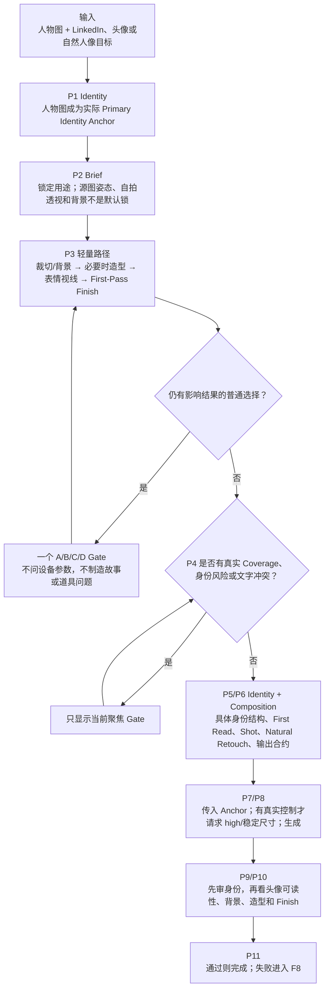

### F2. 全局默认与委派

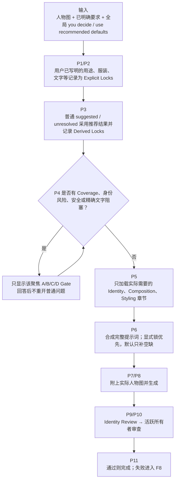

局部刷新中的 `you decide` 只委派已解析出的刷新目标，不等于本流程的全局默认。

### F3. Cosplay 与角色妆容迁移

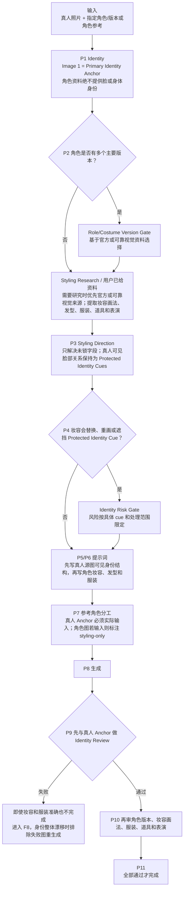

关键不变量：妆容改变颜料、线条、质感、覆盖方式和修饰，不授权放大眼睛、缩鼻、改唇形、改下颌、换肤色或改变年龄感。源图已有妆容但来源未知时，它是 Reference Appearance；只有目标需要的身份 cue 被遮挡才形成 Appearance Coverage 缺口。

### F4. 全身动作与证据缺失

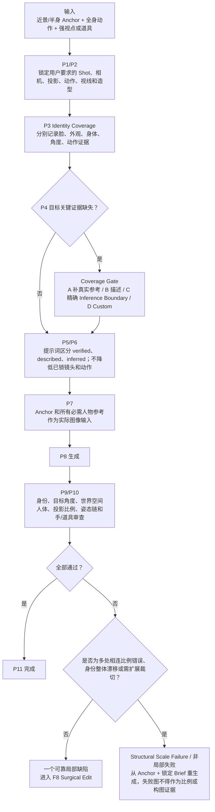

Inference Boundary 只允许推断逐项列出的未知区域或事实；它不会把已验证身体证据改成可变项，也不能替代 Primary Identity Anchor。

### F5. Style / Scoped Refresh

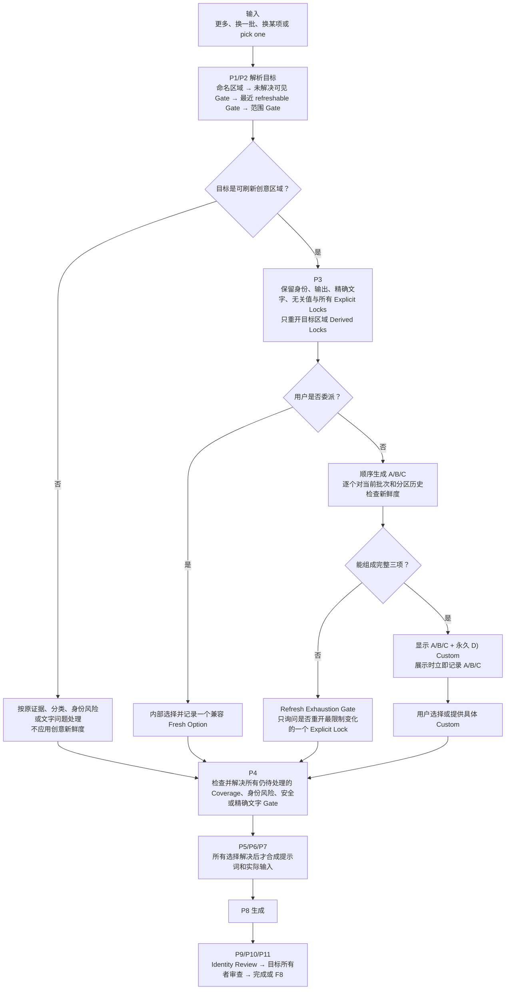

Creative Direction 使用六段 Direction Signature，至少三段不同；其他区域使用所有者可见签名，至少两部分不同。重命名、只换色板、形容词或设备词不算 Fresh Option。询问新选项本身不会生成或修改图片。

### F6. 精确文字与场景冲突

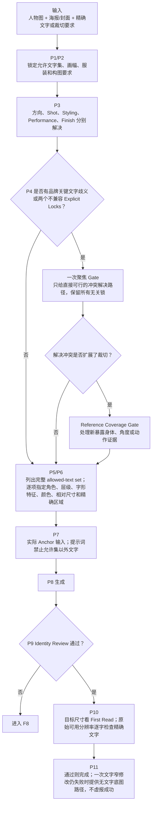

普通缺失字体和排版由方向、布局、First Read、色彩和显示尺寸内部推导，不建立常规 Typography Gate。

### F7. 系列连续性

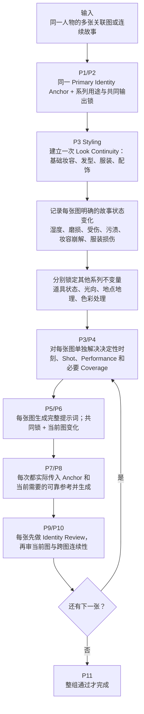

单张图片不创建 Look Continuity；连续性表示可信的状态演化，不要求每个时刻视觉条件完全相同。

### F8. 局部修复、身份漂移与重生成

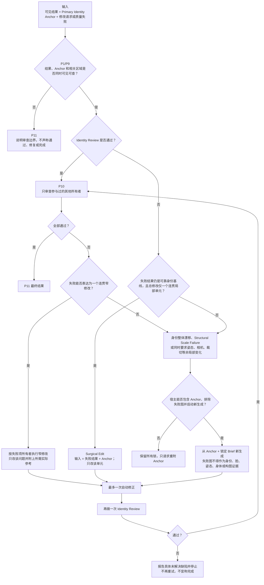

Identity Review 先判断是否完成，再决定恢复范围。妆容、服装或场景做得漂亮不代表身份通过；“用户说不像”也不会自动证明它只是局部缺陷。

F8 是主流程的窄修改例外：已有可见结果时直接从 P9 审查开始，不重新走普通创意澄清；只有需要全新生成时才复用锁定 Brief 和正确实际输入回到生成步骤。

### F9. 安全与宿主能力限制

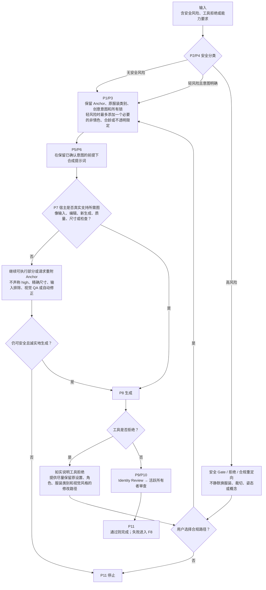

安全处理保持工具无关；能力处理保持事实优先。提示词中的 4K、high quality 或“保留 Anchor”不能替代真实控制。

## 5. 按需读取与所有者路由参考

协调 Module 通过稳定标题只读取当前活跃章节；宿主不支持分段读取时，整文件读取是正确性后备。分段读取不是正确性依赖，也不维护额外 read-state tracker。

| 活跃条件 | 必读章节 | 条件追加 |
| --- | --- | --- |
| 普通人物图生成 | Identity：`Priority`、`Reference Transfer`、`Reference Coverage` | 无 |
| 写最终提示词前 | Identity：`Identity Prompt Constraints`；Composition：`Final-Asset Quality`、`First-Pass Finish`、`Prompt Structure` | 所有当前活跃所有者章节 |
| 创意方向、First Read、决定性时刻 | Composition：`Creative Direction`、`Directorial Intent and Decisive Moment` | 需要选项时加 `Direction Atlas and Freshness`；刷新时加 `Style Refresh` |
| 镜头、透视、相机、投影 | Composition：`Shot Direction` | 按需加 `Perspective Intent`、`Camera and Capture Plan`；侧脸/动作/强透视加身份与姿态章节 |
| 物理世界、品味、媒介配方 | Composition 对应的 `Art Direction and Physical World`、`Taste Rules`、`Prompt Craft Rules` 或 `Output Recipes` 子节 | 只读相关媒介 |
| 服装、头饰、首饰、配件、妆发、道具 | Styling 对应的 `Ownership`、`Risk and Facial Treatment`、`Category Routing`、`Styling Direction` 或 `Props` | 按实际字段选择 |
| 故事造型、Delegated Styling、Story Makeup、Look Continuity | Styling：`Ownership`、`Risk and Facial Treatment`、`Styling Direction`、`Prompt Contributions` | 源造型遮挡关键身份 cue 时加 Identity `Reference Coverage` |
| 姿态、动作、表情、视线、手部、表演 | Styling：`Performance Direction` | 非简单动作加 `Pose Geometry`；脸角度影响身份时加 Identity `Face Visibility and Performance Integrity` |
| 指定角色、制服、历史服装 | Styling：`Role, Costume, and Visual Research` | 多版本时先走版本 Gate |
| 精确文字、布局、交付、变体、系列 | Composition：`Layout and Output Contract` | 文字或分区复杂时加 `Prompt Craft Rules` |
| 展示或替换可刷新 Gate | Refresh：`Scope`、`Visible Gate and History` | 按分支加 `Route the Target`、`Locks and Continuity`、`Refresh Exhaustion`，并加载目标所有者 |
| 审查可见结果 | 先 Identity：`Identity Review and Revision` | 再只读实际参与生成或修改的所有者审查段落 |
| 对可见结果做窄修改 | Identity：`Identity Review and Revision` + 修改项所有者 | 涉及脸时加 `Priority`、`Identity Prompt Constraints`；只在真正触及时补其他核心章节 |

### 提示词合成顺序

1. 用途、画布、布局。
2. Primary Identity Anchor、源图可见身份结构、Reference Transfer 与 Coverage。
3. 已锁意图、First Read、创意方向和决定性时刻。
4. Shot、相机/透视、世界空间人体与投影比例。
5. Styling、Performance、Props、Pose Geometry。
6. 有动机的灯光/色彩、First-Pass Finish、材质和纹理。
7. 精确文字允许集、平台和交付约束。
8. 约 3–8 个本次最可能发生且可观察的失败约束。

禁止用固定高质量后缀、万能负面词表、空字段或紧凑配置块代替完整生产提示词。

### 外部研究、质量与能力

| 条件 | 行为 |
| --- | --- |
| 普通换一批 | 使用当前对话历史与 Direction Atlas，不浏览 |
| 明确 current / latest / trending | Trend Refresh，必须实时研究；无法验证就明说 |
| 指定角色、制服、历史服装 | 优先官方或可靠视觉资料，只提取生产锚点 |
| 正常人物成片 | 按 final asset 处理，不加质量问卷 |
| 有真实质量控制 | 请求 `high` |
| 有真实尺寸控制 | 请求不超过 `3,686,400` 总像素且符合画幅的最高稳定尺寸 |
| 用户要求更高尺寸 | 视为实验尺寸；控制可用时简短警告后继续 |
| 控制不存在 | 继续可执行部分，但不声称已设置 high、2K、4K 等 |
| 需要精确尺寸 | 实际检查输出像素后才能声称 |
| 结果不可见或分辨率不足 | 对相应审查标记 unavailable / unverified |

## 6. Golden 1–121 覆盖矩阵

每个编号在下表恰好出现一次，表示它的主要端到端流程族；Shared Checks 仍横跨全部流程。场景可以触及多个 Module，但不需要复制多张完整图。

| Golden 编号 | 主流程 | 覆盖主题 |
| --- | --- | --- |
| 1 | F1 | 模糊专业头像 |
| 2 | F2 | 显式全局委派 |
| 3-4 | F1 | 引导式人像、已有部分锁 |
| 5 | F4 | 高风险近景到全身动作 |
| 6 | F6 | 精确文字海报 |
| 7 | F7 | 系列连续性 |
| 8 | F8 | 手部窄修改 |
| 9-11 | F4 | 目标角度身份、透视选择、动作姿态链 |
| 12 | F8 | 保留强投影的协调修复 |
| 13-22 | F5 | Style Refresh、历史、Custom、锁来源、趋势、委派与耗尽 |
| 23-29 | F1 | First-Pass Finish 默认、选择、媒介适配与窄修改 |
| 30-46 | F5 | Finish/Scoped Refresh、目标优先级、分区历史、委派、耗尽与分类边界 |
| 47-49 | F1 | 全身/跨媒介成片质量与预览例外 |
| 50 | F9 | 宿主无质量或尺寸控制 |
| 51-58 | F1 | 实验尺寸、First Read、输出配方和短约束 |
| 59 | F5 | 历史不可用时不承诺精确去重 |
| 60 | F4 | 可访问身份图仍必须作为实际输入 |
| 61 | F9 | 必需身份图对工具不可用 |
| 62-63 | F4 | 多参考角色分工、Inference 不替代身份图 |
| 64-66 | F1 | 实验尺寸面积、警告与实际尺寸检查 |
| 67-68 | F8 | 双尺度审查、强角度自然不对称 |
| 69-70 | F9 | 证据不可用限制声称、质量和尺寸控制独立 |
| 71-76 | F6 | 多条精确文字、品牌排版、显式锁冲突与恢复 |
| 77-92 | F3 | Reference Appearance、造型委派、妆容风险、Story Makeup 与物理一致性 |
| 93-94 | F7 | 系列 Look Continuity 与单图不创建连续性 |
| 95 | F1 | 身份可读但不必成为 First Read |
| 96-97 | F8 | 可见 cue 漂移与造型导致的窄恢复 |
| 98 | F4 | 近景扩展全身的比例恢复 |
| 99 | F3 | 厚重服装仍保留可见上身证据 |
| 100-103 | F4 | 累积风险、充分证据、组合 Coverage 与组合 cue 变换 |
| 104-105 | F9 | Anchor 不可用、宿主受限时不伪装重生成 |
| 106 | F3 | 跨类型参考角色保持通用 |
| 107-112 | F8 | 局部/整体身份失败、自动恢复上限、风险范围与尽力而为 |
| 113-115 | F3 | 源图身份细节优先、角色不供脸、妆容形容词不改结构 |
| 116-117 | F6 | 裁切与服装锁冲突、扩裁触发新 Coverage |
| 118 | F8 | 干净呈现不能替代 Identity Review |
| 119 | F2 | 普通 Gate 的全局默认捷径 |
| 120 | F3 | 可靠来源解决角色版本 |
| 121 | F8 | Cosplay 执行干净也不能掩盖身份整体漂移 |

当前编号场景没有单独覆盖安全 Gate 或生成工具安全拒绝；F9 的安全分支来自运行时合约和 Shared Checks。只有后续安全行为发生变更时，才增加最小专门 Golden 场景。

## 7. 维护、验证与优化方向

### 变更影响矩阵

| 变更类型 | 首要所有者 | 还要检查 |
| --- | --- | --- |
| 触发、Gate、状态、生命周期 | `SKILL.md` | 所有参考路由、对应 Golden |
| 身份证据、Coverage、审查、恢复 | `identity-anchor.md` | SKILL 路由、Styling/Composition 依赖、Context、Golden |
| 方向、镜头、Finish、布局、提示词 | `composition-director.md` | Identity/Styling Interface、Golden |
| 妆发服装、道具、表演、角色研究 | `styling-performance.md` | Identity 风险、Composition Shot、Golden |
| 刷新、历史、新鲜度 | `scoped-option-refresh.md` | 目标所有者可见签名、Golden |
| 规范术语或架构决定 | `CONTEXT.md` / `docs/adr/` | 全部运行时使用处、本文档、Golden |
| 安装、调用、示例 | `README.md` / `openai.yaml` | 当前宿主真实能力 |

### 当前规模基线

| 资产 | 当前规模 |
| --- | ---: |
| `SKILL.md` | 4,039 词 |
| `composition-director.md` | 5,877 词 |
| `identity-anchor.md` | 4,097 词 |
| `styling-performance.md` | 2,656 词 |
| `scoped-option-refresh.md` | 788 词 |
| 运行时 Markdown 合计 | 17,457 词 |
| `CONTEXT.md` | 35 个规范术语，1,543 词 |
| `docs/adr/` | 6 条 ADR |
| `golden-conversations.md` | 121 个场景，11,901 词 |

### 优化优先级

1. **先守住唯一所有者**：术语在 Context，行为在所有者，协调 Module 只路由，Golden 只描述可观察结果。
2. **保持稳定标题 Seam**：章节改名时同步路由和 Golden；整文件读取继续作为后备。
3. **先测再压缩**：只有实际上下文成本或遗漏证据出现时，才压缩重复合约；不能删除安全、身份、文字和交付边界。
4. **先静态检查再建评测框架**：人工审查开始漏项时，先检查场景编号、Input/Expected、标题引用和确定性 Gate 结构。
5. **优先加深现有 Module**：只有两个子域持续独立变化且发生真实所有权冲突时，才新增 Seam。
6. **宿主差异按事实处理**：出现第二个具体宿主行为且规则真正分叉时，再定义显式 Adapter 合约。

没有真实失败证据时，不增加独立 Makeup Module、强制后处理、持久化选项历史、read-state tracker、普通刷新联网、质量问卷、固定风格目录、身份分数、无限重试或只有一个实现的抽象 Adapter。

### 架构变更完成定义

- 能指出唯一首要所有者，并说明其他 Module 只是依赖还是共同拥有。
- 没有新增与 `CONTEXT.md` 竞争的同义词，也没有静默违反 ADR。
- `SKILL.md` 路由仍指向真实稳定标题。
- Explicit、Derived、Suggested、Unresolved 状态语义没有被绕过。
- 普通 Gate、聚焦 Gate、Scoped Refresh 和恢复路径没有相互吞并。
- 新行为能落到总流程 P1–P11 和一个流程族中。
- Golden 覆盖表仍无遗漏、无重复，新增或改变行为有对应可观察场景。
- 结构校验、Golden 审计与 `git diff --check` 通过。
- 本文档相应图、职责、规模或优化触发条件已同步更新。
